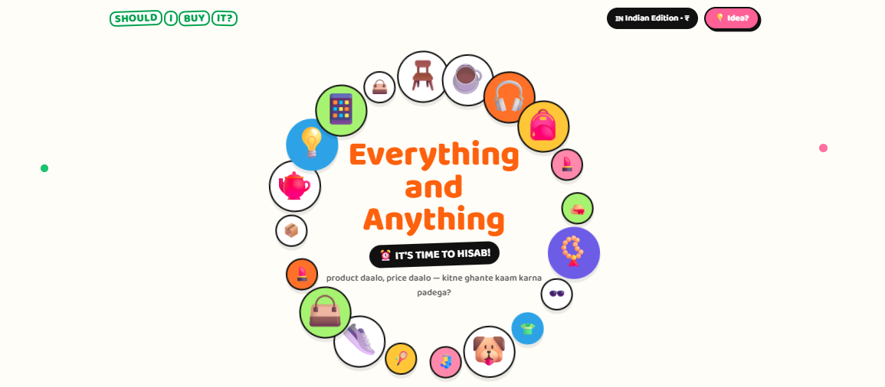
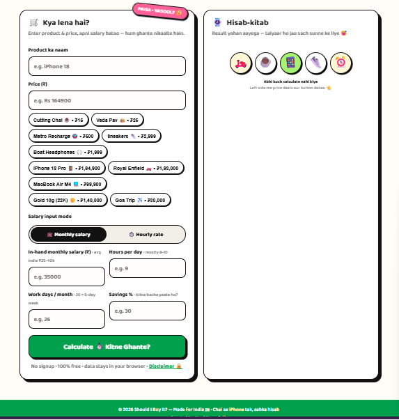
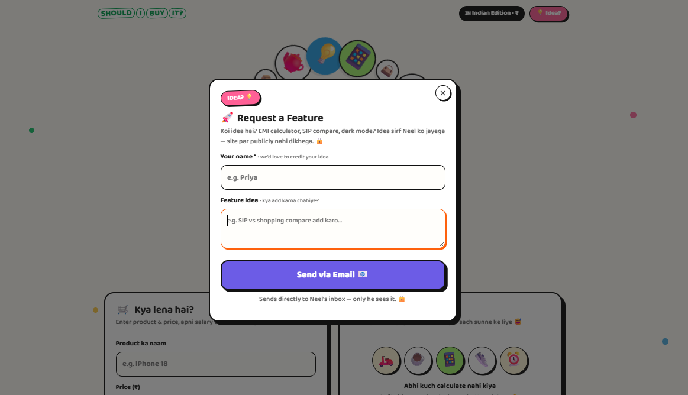
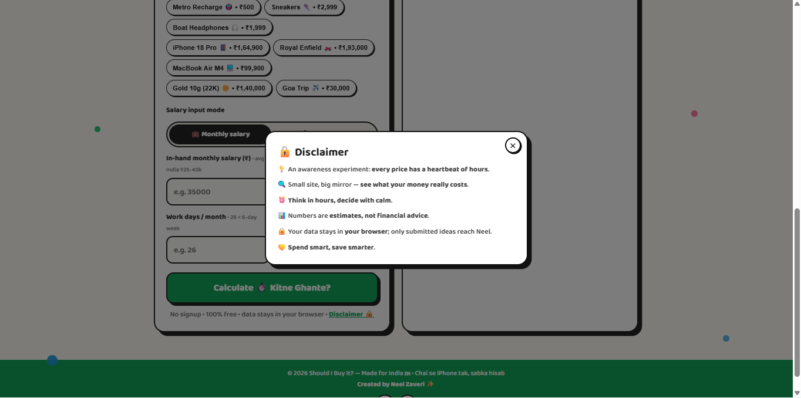

# Should I Buy It? — Indian Edition 🇮🇳

**Think in hours, decide with calm.** A playful one-page calculator that converts any price in ₹ into the work-hours it really costs — with Hinglish verdicts, desi comparisons, and a downloadable result card.

No signup. No backend. One `index.html` file.

## 📸 Screenshots

| Hero | Calculator + Result |
|---|---|
|  |  |

| Request a Feature | Disclaimer |
|---|---|
|  |  |

## ✨ What it does

- **₹ → hours math** — enter product + price, add salary (monthly or hourly mode), get work-hours, work-days, and months-of-savings instantly
- **Hinglish verdicts** — 6 tiers from 🟢 *"LE LE!"* to 🔴 *"RUK JAO!"*, plus 24 rotating advice lines matched to your numbers
- **Desi equivalents** — your price translated into cutting chais, vada pavs, auto rides, movies, and rent-days
- **Indian presets** — Cutting Chai ₹15 to iPhone 18 Pro ₹1,64,900, Royal Enfield, MacBook Air M4, 22K Gold, Goa Trip… one tap fills + calculates
- **Save Hisab 💾** — downloads a PNG image of your result card to flaunt (or regret) later
- **Copy 📋** — copies the result as a neat section-by-section message
- **Recent hisab** — last 5 calculations, private in your browser, one-tap reload
- **💡 Request a Feature** — header tile opens a private idea box, emailed straight to the creator
- **🔒 Disclaimer modal** — honest microcopy: estimates, not financial advice

## 🚀 Run it

No install, no build. Either:

- **Double-click `index.html`**, or
- Serve it (needed for idea-email auto-send):
  ```bash
  npx serve .
  ```

> 📧 **Idea emails** send via FormSubmit and need two one-time steps: host the site over `https://`, then submit once and click the activation email. Opened as a local file, the form falls back to a prefilled email draft.

## 🛠️ Tech

- Single `index.html` — HTML5 + hand-written CSS3 + vanilla ES6, **zero JS dependencies**
- Canvas 2D (hand-drawn share image), `localStorage` (history only), Clipboard API
- Google Fonts (Baloo 2 + Fredoka) is the only CDN
- `docs/` holds 12 living documents: PRD, architecture, TRD, flows, plan, testing, security, style, database, API + agent guide

## 🧮 The math

```
hourlyRate    = salary ÷ (days/month × hrs/day)
effectiveRate = hourlyRate × savings%
hours         = price ÷ effectiveRate
days          = hours ÷ hrs/day
months        = price ÷ (salary × savings%)
```

## 🔒 Privacy

Inputs and history never leave your browser. Network fires only for fonts — and for idea emails, only when **you** press Send. No accounts, no tracking, no cookies.

## 💛 Creator

**Neel Zaveri** — [GitHub](https://github.com/neeelzaveri) · [LinkedIn](https://linkedin.com/in/neel-zaveri)

*Small site, big mirror: see what your money really costs. Spend smart, save smarter.*
